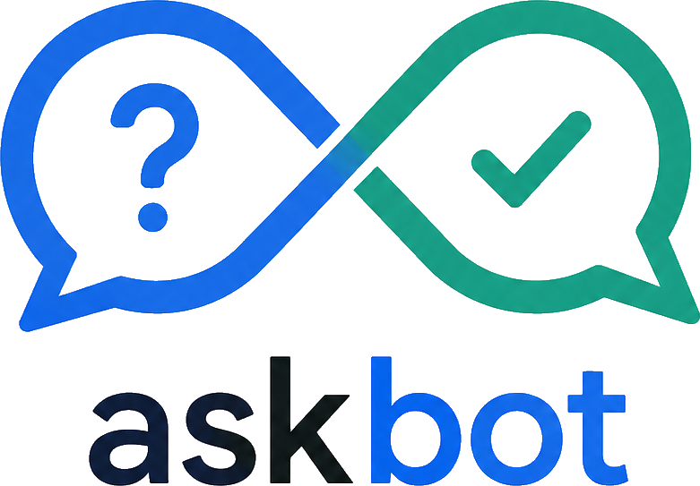

<p align="center"></p>

# askbot

An easy to use, self-hosted Q/A board written in plain PHP on MySQL.
Questions get a permanent home, answers get votes, karma and badges keep
people coming back — and all of it lives on your own server.

**Project site & docs:** https://andreaskasper.github.io/askbot_php/

## Features

- Questions, answers and comments — guests can post behind a captcha
- Karma rule engine and badges
- Tags with their own editable info pages
- Optional Akismet spam checking
- Skins (`src/skins/`) and gettext locales (`src/locales/`, de_DE + en_US)
- Plugins and a cron entry point
- One MySQL schema, installed by the built-in web installer

## Quick start

```bash
cd /var/www
git clone --depth 1 https://github.com/andreaskasper/askbot_php.git askbot
```

1. Point your Apache document root at `askbot/src/` (mod_rewrite enabled).
2. Create an empty MySQL database and a user for it.
3. Open the site in a browser — the installer does the rest.

Details, deployment and hardening: see the
[docs](https://andreaskasper.github.io/askbot_php/docs.html),
[deployment guide](https://andreaskasper.github.io/askbot_php/deploy.html) and
[security page](https://andreaskasper.github.io/askbot_php/security.html).

## History

askbot started on SourceForge and moved to GitHub in 2016 (last SourceForge
revision: R172). In 2023 the code was restructured into `src/`. The next
version is currently in progress — see the
[roadmap](https://andreaskasper.github.io/askbot_php/roadmap.html).

## License

[AGPL-3.0-or-later](LICENSE) — © Andreas Kasper.
